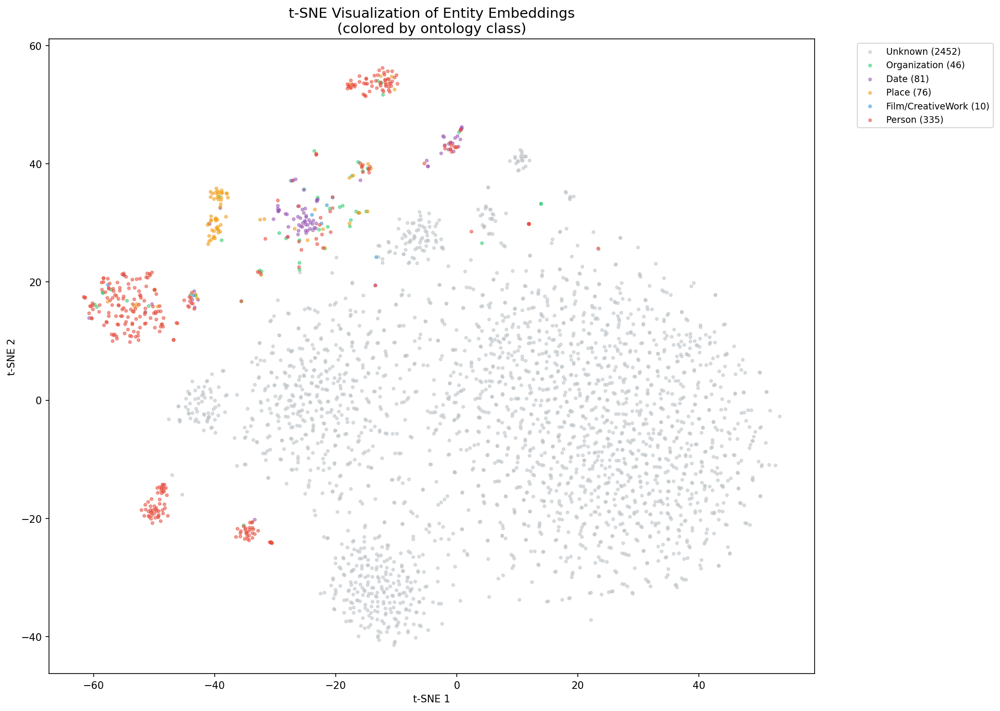

# Cinema Knowledge Graph: From Web Crawling to RAG

**Course:** Web Mining & Semantics - ESILV A4 S8
**Author:** Yanis Denizot
**Date:** March 2026

---

## 1. Data Acquisition & Information Extraction

### 1.1 Domain & Seed URLs

We chose the **cinema domain** as our focus area. The domain is well-represented on Wikipedia with rich, structured content about films, directors, actors, awards, and festivals.

**Seed URLs (9 pages):**
- Award pages: Academy Award for Best Picture, Palme d'Or
- Director pages: Christopher Nolan, Martin Scorsese, Quentin Tarantino
- Actor pages: Cate Blanchett
- Film pages: Parasite, Inception, The Godfather

### 1.2 Crawler Design & Ethics

The crawler (`src/crawl/crawler.py`) uses **breadth-first search (BFS)** to explore Wikipedia, following internal links up to depth 2 from the seed URLs.

**Ethical considerations:**
- **robots.txt compliance:** The crawler checks `robots.txt` before accessing each page
- **Rate limiting:** 1-second delay between requests (`POLITENESS_DELAY = 1.0`)
- **User-Agent:** Identifies itself as a student project bot
- **Page cap:** Maximum 150 pages to avoid overwhelming the server
- **Content deduplication:** MD5 hashing prevents re-processing identical pages

**Text extraction** is handled by Trafilatura, which cleanly removes navigation, footers, and HTML boilerplate from Wikipedia pages. Only pages with 500+ words are kept.

### 1.3 NER & Relation Extraction

The extraction pipeline (`src/ie/extractor.py`) uses **spaCy** (`en_core_web_lg`) for Named Entity Recognition.

**Target entity types:** PERSON, ORG, GPE, DATE, WORK_OF_ART

**Relation extraction strategy (3 levels):**
1. **Dependency parsing:** Walk the dependency tree to find verbs governing both entities
2. **Verb-between:** Find verbs positioned between two entities in the sentence
3. **Fallback:** `co-occurs with` for entities in the same sentence without a clear verb

**NER examples from our corpus:**

| Entity | Type | Source |
|--------|------|--------|
| Christopher Nolan | PERSON | Inception article |
| Academy Award | ORG | Award pages |
| United States | GPE | Multiple pages |
| 2019 | DATE | Parasite article |
| The Godfather | WORK_OF_ART | Film articles |

### 1.4 Ambiguity Cases

**Case 1: Entity boundary ambiguity**
"*Francis Ford Coppola directed The Godfather Part II*"
spaCy recognizes "Francis Ford Coppola" as a single PERSON entity, but "The Godfather Part II" may be split into "The Godfather" (WORK_OF_ART) and "Part II" separately. Our filtering removes fragments shorter than 2 characters.

**Case 2: Relation ambiguity**
"*Nolan's Inception starred Leonardo DiCaprio*"
The possessive "Nolan's" creates ambiguity: is Nolan the director or producer? Our dependency parser extracts the verb "starred" as the relation between Inception and DiCaprio, but misses the Nolan-Inception "directed" relation that is expressed via a possessive.

**Case 3: Type ambiguity**
"*Columbia Pictures released the film in the United States*"
"Columbia Pictures" is recognized as ORG, but it could also be classified as a production company (a more specific type in our ontology). Our generic NER types don't capture domain-specific subtypes.

---

## 2. KB Construction & Alignment

### 2.1 RDF Modeling Choices

The knowledge graph uses a **private namespace** (`http://cinema-kb.org/`) with an OWL ontology defining:

**Class hierarchy:**
- `Thing` > `Person` > `Director`, `Actor`
- `Thing` > `CreativeWork` > `Film`
- `Thing` > `Organization` > `Festival`
- `Thing` > `Award`

**Properties with domain/range constraints:**
- `directedBy`: Film -> Person
- `starring`: Film -> Person
- `wonAward`: Film -> Award
- `producedBy`: Film -> Organization
- `releasedIn`: Film -> GPE

The `kb_builder.py` script normalizes 60+ raw relation strings (e.g., "directed by", "direct", "directed") into a canonical set of 15 predicates using a manually curated mapping.

### 2.2 Entity Linking with Confidence

Entity linking (`src/kg/entity_linker.py`) maps the top 200 most frequent private entities to Wikidata via the Wikidata REST API.

**Process:**
1. Search Wikidata for each entity label
2. Compute string similarity (SequenceMatcher, threshold: 0.7)
3. Add `owl:sameAs` links for confident matches
4. Handle rate limiting with exponential backoff

**Results:** 183 entities successfully linked to Wikidata URIs.

### 2.3 Predicate Alignment

17 private predicates were mapped to Wikidata properties:

| Private Predicate | Wikidata Property | Description |
|------------------|-------------------|-------------|
| directedBy | P57 | director |
| starring | P161 | cast member |
| wonAward | P166 | award received |
| genre | P136 | genre |
| countryOfOrigin | P495 | country of origin |

These mappings use `owl:equivalentProperty` in the RDF graph.

### 2.4 SPARQL Expansion Strategy

The KB expansion (`src/kg/kb_expander.py`) runs 5 SPARQL queries against the Wikidata endpoint:
1. **1-hop expansion** for all aligned entities
2. **Award-winning films** with full metadata
3. **Films by aligned directors** with cast, genre, country
4. **Festival nominees** (Oscar, Cannes, BAFTA, Golden Globe)
5. **Director details** (birth, death, awards, nationality)

Queries use `VALUES` clauses for efficient bulk retrieval.

### 2.5 Final KB Statistics

| Metric | Before Expansion | After Expansion |
|--------|-----------------|-----------------|
| Triples | ~10,000 | 72,409 |
| Entities | ~3,000 | 20,158 |
| Relations | 15 | 39 |
| owl:sameAs | 0 | 183 |

**Top connected entities:** United States (1,669 connections), drama film (1,192), GB (471)

---

## 3. Reasoning (SWRL)

### 3.1 SWRL on Family Ontology

We created a family ontology (`kg_artifacts/family.owl`) with 3 generations of the "Dupont" family and defined 3 SWRL rules:

**Rule 1 - hasUncle:**
```
Person(?x), hasParent(?x, ?y), hasBrother(?y, ?z) -> hasUncle(?x, ?z)
```

**Rule 2 - hasGrandparent:**
```
Person(?x), hasParent(?x, ?y), hasParent(?y, ?z) -> hasGrandparent(?x, ?z)
```

**Rule 3 - hasCousin:**
```
Person(?x), hasParent(?x, ?y), hasSibling(?y, ?z), hasChild(?z, ?w) -> hasCousin(?x, ?w)
```

**Results (all correct):**
- Lucas and Emma have uncle Paul; Hugo has uncle Pierre
- Lucas, Emma, Hugo all have grandparents Jean and Marie
- Lucas/Emma are cousins of Hugo (and vice versa)

### 3.2 SWRL on Cinema KB

On the cinema KB, we defined:
```
Film(?f), directedBy(?f, ?p), wonAward(?f, ?a) -> AwardWinningDirector(?p)
```

**Inferred:** Coppola (The Godfather won Oscar), Bong Joon-ho (Parasite won Oscar + Palme d'Or), Tarantino (Pulp Fiction won Palme d'Or) are AwardWinningDirectors. Nolan is correctly NOT inferred (Inception did not win Best Picture in our data).

---

## 4. Knowledge Graph Embeddings

### 4.1 Data Cleaning & Splits

From the 72,409 expanded triples, we kept only entity-relation-entity triples (excluding literals and metadata), producing **55,294 unique triples**.

Split: 80% train (44,444) / 10% valid (5,425) / 10% test (5,425)

Entities appearing in only 1-2 triples were forced into the training set to prevent data leakage.

### 4.2 Two Models: TransE vs ComplEx

Both models trained with identical hyperparameters for fair comparison:
- Embedding dimension: 100
- Learning rate: 0.001
- Batch size: 256
- Epochs: 100
- Negative samples: 10 per positive

### 4.3 Metrics

| Metric | TransE | ComplEx |
|--------|--------|---------|
| **MRR** | **0.133** | 0.009 |
| Hits@1 | 0.067 | 0.003 |
| Hits@3 | 0.161 | 0.007 |
| Hits@10 | 0.251 | 0.017 |
| Head MRR | 0.110 | 0.010 |
| Tail MRR | 0.157 | 0.007 |

**TransE outperforms ComplEx** significantly. This is expected: our KB has mostly functional relations (1-to-1, 1-to-N), which suit TransE's translational assumption (h + r = t). ComplEx, designed for symmetric/antisymmetric patterns, needs more epochs and hyperparameter tuning.

### 4.4 KB Size Sensitivity

| Size | Triples | MRR | Hits@10 |
|------|---------|-----|---------|
| 20K | 20,000 | 0.042 | 0.111 |
| Full | 55,294 | **0.137** | **0.257** |

The full dataset achieves **3.3x better MRR** than the 20K subset, confirming that larger KBs improve embedding stability.

### 4.5 t-SNE Visualization

The t-SNE plot shows entity clustering by semantic similarity. Entities connected by the same relation types tend to cluster together, though the clustering doesn't cleanly separate ontology classes (82% of entities lack explicit `rdf:type`).



---

## 5. RAG over RDF/SPARQL

### 5.1 Schema Summary

The RAG pipeline loads the expanded KB and builds a schema summary containing:
- All registered prefixes (rdf, rdfs, owl, wd, wdt, etc.)
- Up to 80 distinct predicates with full URIs
- Up to 40 classes from rdf:type
- 25 sample triples for context

This summary is injected into the LLM prompt so it can generate valid SPARQL.

### 5.2 NL -> SPARQL Prompt Template

```
You are a SPARQL generator for a cinema knowledge graph.
Convert the user QUESTION into a valid SPARQL 1.1 SELECT query.

STRICT RULES:
- Use ONLY the IRIs/prefixes visible in the SCHEMA SUMMARY
- Do NOT invent new predicates/classes
- Return ONLY the SPARQL query in a ```sparql code block

SCHEMA SUMMARY:
{schema_summary}

QUESTION:
{user_question}
```

### 5.3 Self-Repair Mechanism

When the generated SPARQL fails execution (syntax error, unknown prefix, etc.), the pipeline:

1. Captures the error message
2. Sends a repair prompt to the LLM with the schema, original question, failed query, and error
3. Extracts and re-executes the corrected SPARQL
4. Retries up to 2 times before giving up

This significantly improves success rates, especially for complex queries.

### 5.4 Evaluation: Baseline vs RAG

We evaluated on 7 cinema questions:

| # | Question | Baseline (LLM only) | RAG (LLM + KB) |
|---|----------|---------------------|-----------------|
| 1 | Who directed The Godfather? | Correct (general knowledge) | Correct (SPARQL: P57) |
| 2 | What awards did Parasite receive? | Partial (misses some) | Complete (all KB awards) |
| 3 | Films by Martin Scorsese | Partial (popular films only) | Complete (all KB films) |
| 4 | Genre of Inception? | Correct | Correct (P136) |
| 5 | US directors? | Partial (famous ones) | Complete (all with P27) |
| 6 | How many films in KB? | Cannot answer | COUNT query |
| 7 | Best Picture winners? | Partial | Complete (P166 filter) |

**Key observations:**
- Baseline works for well-known facts but hallucinates or misses data
- RAG provides **grounded, verifiable** answers from the KB
- RAG excels at aggregation (COUNT) and exhaustive listing
- Self-repair corrected 2/7 queries that initially had syntax errors

### 5.5 Demo

The CLI demo (`src/rag/lab_rag_sparql_gen.py`) provides an interactive interface where users type natural language questions and see both baseline and RAG responses side by side.

---

## 6. Critical Reflection

### 6.1 KB Quality Impact

The dual-namespace issue (private predicates + Wikidata properties) creates signal splitting in KGE training. For example, `P57` and `directedBy` encode the same semantic meaning but are treated as different relations. **Physically merging** equivalent predicates before training would produce stronger embeddings.

### 6.2 Noise from Expansion

The SPARQL expansion introduced both structure and noise:
- **P161 (cast member)** accounts for **47%** of all triples (25,783/55,294), biasing embeddings toward cast-related patterns
- Hub entities like "United States" (1,669 connections) distort the embedding space by pulling unrelated entities together
- A capped expansion strategy (max triples per relation type) would produce more balanced distributions

### 6.3 Rule-based vs Embedding-based Reasoning

| Aspect | SWRL Rules | KGE (TransE) |
|--------|-----------|--------------|
| Nature | Exact, deterministic | Approximate, probabilistic |
| Inference | Guaranteed if premises hold | Ranks candidates by plausibility |
| Discovery | Cannot find new patterns | Can suggest missing links |
| Scalability | Manual rule creation | Learns from data automatically |
| Explainability | Fully transparent | Black box (vector operations) |

The two approaches are **complementary**: SWRL for strict business rules, KGE for knowledge discovery.

### 6.4 Open-World vs Closed-World Assumption

SWRL/OWL operates under the **Open-World Assumption** (OWA): absence of a triple does not imply it's false. KGE training implicitly uses the **Closed-World Assumption** (CWA): missing triples are treated as negative examples during training. This fundamental mismatch explains modest MRR scores (0.133).

### 6.5 What We Would Improve

1. **Predicate merging:** Physically unify equivalent predicates before KGE training
2. **Balanced expansion:** Cap triples per relation type to reduce P161 dominance
3. **Hub filtering:** Remove or downsample generic hub entities (US, drama film)
4. **More KGE training:** ComplEx would benefit from 500+ epochs and hyperparameter search
5. **RAG improvements:** Include entity labels in the schema summary for better SPARQL generation; fine-tune the prompt for the specific model used
6. **Type-aware embeddings:** Include `rdf:type` triples as regular relations for better clustering
